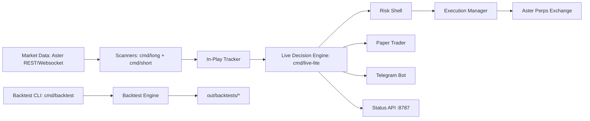

# Architecture Overview

## System map

## Major modules

- `adapters/aster`: exchange integration, account, orderbook, execution REST.
- `internal/features`: feature engine and snapshot composition.
- `internal/strategies`: setup logic + router + risk-policy transforms.
- `internal/risk`: centralized pre-trade hard-gate shell.
- `internal/backtest`: event-loop simulation and report writing.
- `cmd/live-lite`: production runtime (paper/live-lite), maintenance, payout, telegram.
- `cmd/long`, `cmd/short`: scanner servers and JSON APIs.

## Runtime invariants

- Timezone baseline: `America/Chicago` for operational windows and reporting.
- Two maintenance windows supported in live-lite.
- Paper/live share strategy/risk decision paths; transport differs.
- State files are persisted under `out/` (or overridden by env/state dir).
