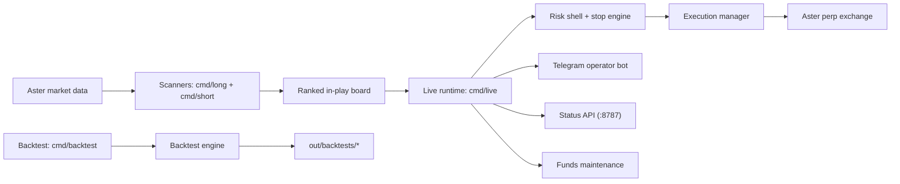

# Architecture Overview

## System map

## Major modules

- `cmd/live`: the production runtime. It owns scanning intake, candidate
  selection, paper/live execution, manual trade adoption, Telegram controls,
  status serving, and perp balance maintenance.
- `cmd/long`, `cmd/short`: ranking scanners and JSON/HTML surfaces.
- `adapters/aster`: exchange integration, balances, positions, leverage,
  order placement, cancel/replace, and signed account actions.
- `internal/features`: snapshot generation used by scanners and live.
- `internal/strategies`: setup scoring, persistence, continuation, and
  directional opportunity shaping.
- `internal/risk`: the hard gate before any live order reaches the exchange.
- `internal/notify`: Telegram-facing formatting for status, fills, digests,
  scanner snapshots, and operator commands.
- `internal/backtest`: event-loop simulation and report generation.

## How the live system works

### 1. Scanners rank the market

`cmd/long` and `cmd/short` continuously rank symbols by grade, score, slope,
state, price change, and liquidity context. The `live` runtime consumes the
ranked board rather than trading raw candles in isolation.

### 2. Live chooses a candidate

`cmd/live` filters candidates through:
- grade and score thresholds
- persistence and reject memory
- stop geometry and expected hold quality
- risk shell checks
- available margin, open-position limits, and symbol cooldowns

The current operating model is fixed-size and no-add by default:
- starter size: `$50`
- re-entry size: `$50`
- no pyramiding
- max concurrent positions: `4`
- max per side: `4`

### 3. Orders are placed and managed

Bot-native trades start from configured leverage and can step down if exchange
or risk constraints reject the requested leverage. Live exits are reduce-only
limit orders. Protection is stop-based, with trailing and profit-lock logic on
top.

Key current behavior:
- profit protection arms once the trade is clearly working
- runners now hold through healthier pullbacks
- exits rely more on real deterioration than on mild cooling

### 4. Manual trades can be adopted

Manual trades detected on exchange are imported first. When the operator sends
`/manage SYMBOL y`, the bot:
- adopts the existing live position
- promotes it into a bot-managed manual state
- aligns leverage toward the configured live leverage
- forces the first protection attach immediately
- continues retry/backoff only if the exchange rejects the stop

The intended standard is:
- `/manage SYMBOL y` means the bot owns the trade
- if the stop is legal, a real stop should appear on exchange immediately

### 5. Telegram is the operator surface

Telegram is used for:
- `/status`, `/balance`, `/positions`
- `/manage SYMBOL y|n`
- `/protect SYMBOL`
- `/scanner`, `/longs`, `/shorts`
- pause/resume and close controls

### 6. Funds are maintained automatically

The live runtime can maintain the perp account on a clock:
- target perp balance: `$200`
- floor: `$150`
- funds check: every `60s`

Behavior:
- if perp available is above target, sweep the excess to spot
- if perp available is below floor, top back up toward target

## Runtime invariants

- Timezone baseline: `America/Chicago` for operations and reporting.
- Paper and live share the same decision path; only execution transport differs.
- State is persisted under `out/` locally or `LIVE_STATE_DIR` on a dedicated host.
- The repo no longer ships a prescribed tmux/systemd orchestration layer; run
  commands directly or through your own host/container supervisor.
- Logging is environment-driven via `ASTER_LOG_DIR`.
